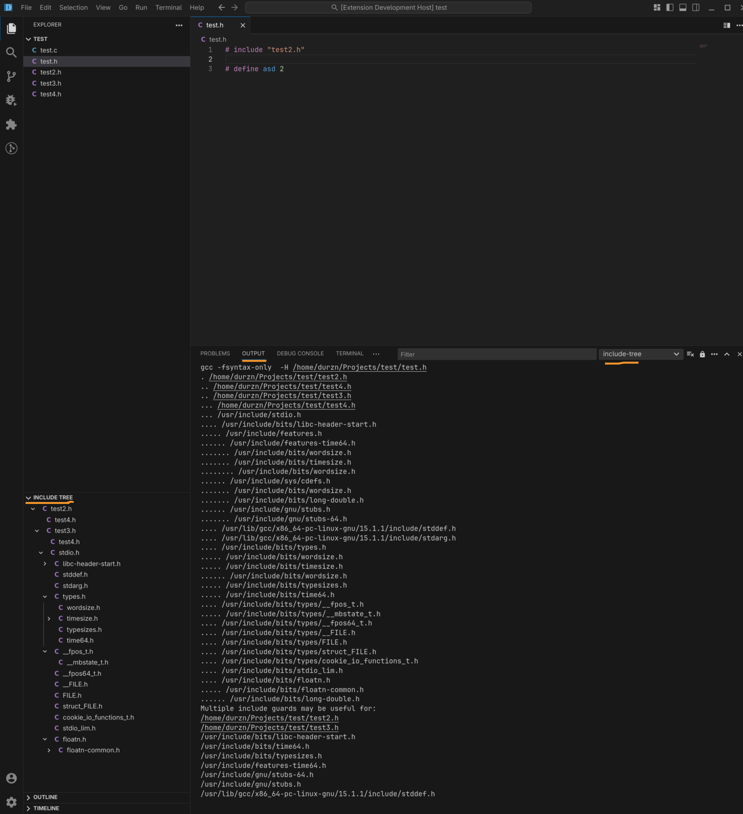

# include-tree README

Extension to visualize the include tree of files.

## Features

- Get a tree view with the include tree of either your open text files or of specifically chosen files
- Clicking on a file in the Include Tree will open the file

| Example                    | Description                                                                                                                                                  |
| -------------------------- | ------------------------------------------------------------------------------------------------------------------------------------------------------------ |
|     | Show include graph of an opened file in a new VsCode view. See the parsed output of the compiler calls in a special VsCode output channel for the extension. |

## Requirements

You must have a compiler (currently: gcc, g++, clang, clang++) installed.
Your version of these compilers must support both the -fsyntax-only and -H switches.

## Getting Started

The setup to get started with this extension is quite easy.
All you have to do is set `include-tree.compilerPath` to one of the compilers mentioned in the requirements.
Then, you should be able to see an include tree in the VsCode view provided by the extension.
If not, refer to the chapter [In-depth look on features](#in-depth-look-on-features)

## In-depth look on features

The extension will try its best to resolve includes, but since native compiler settings (i.e. -fsyntax-only and -H switches) are used, all the extension can do is guess. Its purpose is not to be yet another build system, but rely on compiler implementations.
The extension will parse the whole workspace for possible include files (and append them to the additional includes passed to the compiler) if `include-tree.scanWorkspaceForIncludes` is enabled.

Should you get compile errors in the output channel, you will have to do one of the following things:

1. (Recommended) Use a compile_commands.json as input for the extension via the `include-tree.compileCommandsPath` setting
2. Manually add the missing include paths via the `include-tree.additionalIncludes` setting

To check that everything is working as expected, you can always open the output channel that is created by the extension. Both the call to the compiler
and the output is redirected there.

## Extension Settings

This extension contributes the following settings:

| Setting                                   | Description                                                                                                                                                                                                      |
| ----------------------------------------- | ---------------------------------------------------------------------------------------------------------------------------------------------------------------------------------------------------------------- |
| `include-tree.extensionMode`              | Mode to operate on. Automatic (default) shows the include tree of the currently active file in the editor. Manual always shows the tree explicitly requested by the user (via context menu in the file browser). |
| `include-tree.compileCommandsPath`        | Path to a compile_commands.json. This will resolve includes paths for link targets. Note that header files are not listed here, and thus a separate option (either additionalIncludes or scanWorkspaceForIncludes) must be used in combination. |
| `include-tree.compilerPath`               | Full path to the compiler executable. Alternative: Use the compiler name (e.g. gcc), so the first occurrence in the path is taken.                                                                               |
| `include-tree.maxIncludeDepth`            | The max include depth to scan. Beware of circular inclusions.                                                                                                                                                    |
| `include-tree.scanWorkspaceForIncludes`   | Whether to automatically include all headers present in the vscode workspace. Note that when this option is not used, header files will not be correctly resolved, as they are not listed in compile_commands.json files. You must specify all paths in the additionalIncludes settings then.  |
| `include-tree.additionalIncludes`         | Includes paths to scan for header locations.                                                                                                                                                                     |
| `include-tree.excludedIncludes`           | Paths not to scan for header locations. Must be absolute paths.                                                                                                                                                  |
| `include-tree.cachedDirectories`          | Directories where include trees should be cached and not be re-created on demand. paths.                                                                                                                                                  |
| `include-tree.openFilesOnClick`          | Whether to open files when clicking on them in the tree view. Requires a restart of the extension to work. |

## Known Issues

None so far.

# Feature requests and bug reports
Please mail them to me at dev@durzn.com or create an issue in GitHub.

# Support
I'm working on projects like this extension in my free time. 
If you want to buy me a coffee to keep me awake for more work on my projects, I'd greatly appreciate it.

I also gladly accept ``Ada`` over this address: ``addr1qyz4hp9a5m844c5dn7nz56vget0lcx2lxg9eg02x9nyg82m7306tyvjqygl08grv79tm2jw0sh9lg8nr5u0g0qvf2nlsw376z4``
